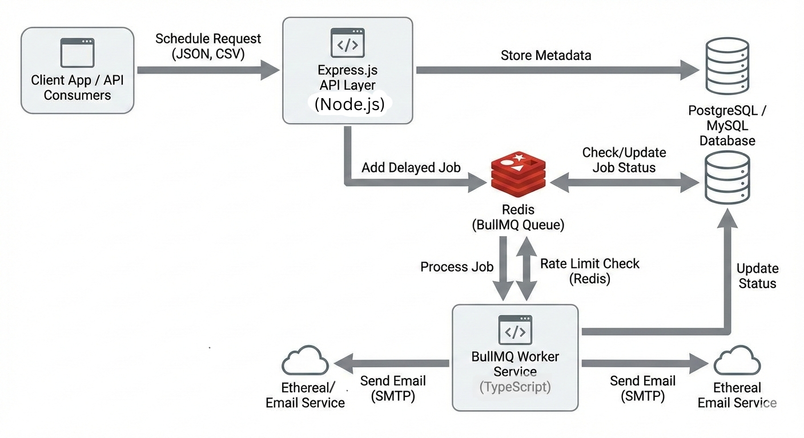

# 📧 Email Scheduling Service

A **scalable, fault-tolerant email scheduling service** that survives server restarts and guarantees **idempotent email delivery**.  
Built using **Node.js, BullMQ, Redis, PostgreSQL**, and a simple frontend dashboard.

---

## ✨ Key Highlights

-  Delayed & scheduled email delivery  
-  Idempotent job execution (no duplicate emails)  
-  Persistent job storage (Redis + PostgreSQL)  
-  Horizontally scalable worker model  
-  Per-sender rate limiting  
-  Frontend dashboard for monitoring  

## Architecture overview: 
### 1. Scheduling 
    - User schedules email from the frontend
    - Database registers it as a new email entry
    - Then the job is added  into BullMQ queue. BullMQ maintains jobs data on redis.
    - The status of cuurent job is set as 'processing'  and Ethereal is invoked to send email.
    - On job completion, status is updated to  'completed'.
    - On job failure , status is updated to 'failed'.
    - BullMQ processes jobs based on delay time. It works using FIFO by default.
    - It maintains unique jobs in the queue , maintaining idempotency

### 2. Persistance: 
    - If server crashes or restarts , the scheduled jobs will not be lost . Jobs are stored on Redis DB and on postgre as well. We can recover the loss and resume the schdule again.
    - During restart, server scans DB for failed jobs and reschedules them in BullMQ.

### 3. Rate Limiting and concurrency : 
    - Rate Limiting is implemented by using 'limiter' configuration while creating new Queue in BullMQ. It is implemented on per sender where each sender can schedule 50 emails per hour.
    - For now concurrency is hardcoded to 3, 3 workers will work on jobs concurrently. 

### 4. Features implemented: 
    - Backend: scheduler, persistence, rate limiting, concurrency, DB, idempotency
    - Frontend: dashboard, compose, tables

## To run backend : 
    1. Start redis server (for local machine)
    2. npm install
    3. node index.js

## To run frontend :
    1. npm install
    2. npm run start

## Ethereal and env variables setup :
    PORT=4000

    # Database (Postgres)
    DB_HOST=localhost
    DB_PORT=5432
    DB_NAME= your_db_name (for local)
    DB_USER= your_username
    DB_PASSWORD= <password>
    DB_URL=  <db_url>

    # Redis
    REDIS_HOST=127.0.0.1 - local
    REDIS_PORT=6379
    REDIS_URL= <Redis_url>

    # Email throttling
    EMAIL_MIN_DELAY_MS=
    MAX_EMAILS_PER_HOUR=200

    # SMTP (Ethereal)
    SMTP_HOST=smtp.ethereal.email
    SMTP_PORT=587
    SMTP_USER=your_ethereal_user
    SMTP_PASS=your_ethereal_pass

    
